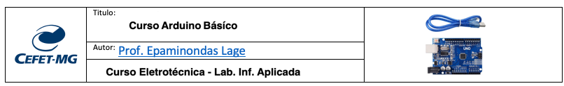

<td style="width: 20%;"></td>

# Objetivo Geral  

O objetivo do curso é auxiliar os alunos do primeiro ano do curso de Eletrotécnica a compreender e aplicar os fundamentos básicos de componentes eletrônicos utilizados no curso e da programação por meio da plataforma Arduino. Ao final do curso, os alunos deverão ser capazes de desenvolver projetos básicos que integrem conhecimentos teóricos e práticos a problemas reais. 

# Objetivos Específicos  

* **Fundamentos de eletrônica:** Proporcionar aos alunos uma compreensão dos conceitos básicos de componetes eletrônicos, à análise de circuitos simples aplicando das leis da eletricidade. 

* **Introdução à programação:** Ajudar os alunos a se familiarizarem com conceitos básicos de programação, introduzindo estruturas de controle, variáveis básicas e funções através da linguagem C/C++ utilizando a IDE Arduino.  

* **Explorar o Arduino:** Capacitar os alunos a manusear o Arduino e demais componentes, entender sua arquitetura, periféricos e ambiente de desenvolvimento integrado (IDE), para dar-lhes autonomia na implementação de projetos.  

* **Desenvolvimento de projetos:** Orientar os alunos na concepção e implementação de projetos utilizando Arduino, como controle de LED (diodos emissores de luz),LDR ,Displays, controle de motores DC, utilização de sensores analógicos e digitais, entre outros projetos.  

* **Interação com ambientes reais:** Permitir que os alunos explorem a conexão entre o Arduino e o mundo real, utilizando entradas e saídas digitais e analógicas para controlar dispositivos externos, assim como coletar dados do ambiente.  

* **Resolução de problemas:** Desenvolver habilidades de resolução de problemas, permitindo que os alunos identifiquem e resolvam desafios comuns ao desenvolver um projeto Arduino.  

* **Projeto final integrado:** Estimular a criatividade e a aplicação prática dos conhecimentos adquiridos através da elaboração e implementação de um projeto final que inclua vários conceitos estudados ao longo do curso.  

# Metodologia 

* Aulas expositivas para apresentação de conceitos teóricos básicos. 
* Atividades práticas de laboratório para aplicar conhecimentos aprendidos e desenvolver habilidades técnicas. 
* Uso de material educacional adicional, como tutoriais on-line e documentação oficial do Arduino, para apoiar o aprendizado.  

# Avaliação

* A avaliação baseia-se na participação nas aulas e na realização de atividades práticas e teóricas. 
* Avaliação do projeto final, levando em consideração critérios como originalidade, aplicação dos conceitos aprendidos e funcionalidade do projeto.

# Repositórios Complementares

* [Discliplina_Informática Aplicada](https://github.com/Epaminondaslage/Lab_Inf_Aplicada)
* [Kit IoT - GitHub](https://github.com/Epaminondaslage/Kit-IoT)
* [Automação Residencial](https://github.com/Epaminondaslage/Automacao_Residencial)
* [Ecossistema didático de automação residencial e industrial](https://github.com/Epaminondaslage/Automacao-industrial-e-residencial-Ecossistema-didatico)

# Kit Arduino Básico- Componentes

| Descrição                                                                 | Quantidade |
|---------------------------------------------------------------------------|------------|
| Placa Arduino Uno SMD R3 + Cabo USB                                       | 01         |
| Resistor 10kΩ / 1/8W                                                       | 10         |
| Resistor 220Ω / 1/8W                                                        | 10         |
| Módulo Relé / Relay 5V de 1 Canal                                           | 01         |
| Protoboard 400 Pontos                                                        | 01         |
| Display LED 7 segmentos, cátodo comum, vermelho 1 Dígito 0,39 cm           | 02         |
| Display de 7 segmentos com 1 Dígito, ânodo comum, vermelho                  | 01         |
| Interruptor Botão 12x12 com capa colorida                                    | 02         |
| Push Button (Chave Táctil) 6x6x5mm                                          | 01         |
| LED Alto Brilho 5mm Branco                                                   | 10         |
| LED Vermelho 5mm                                                             | 01         |
| LED Verde 5mm                                                                | 01         |
| LED Branco 5mm                                                               | 02         |
| Sensor Fotoresistor LDR de 5mm                                               | 01         |
| Sensor DHT22 de Temperatura e Umidade                                        | 01         |
| Cabo Jumper Macho x Macho 20 cm                                              | 10         |

# Sensores para Arduino

Sensores para Arduino são dispositivos que permitem ao Arduino detectar e medir o ambiente ao seu redor. Eles podem capturar uma variedade de informações, como temperatura, umidade, luz, movimento, som, distância, entre outros. Esses sensores são conectados ao Arduino através de pinos digitais ou analógicos e fornecem dados que podem ser utilizados para tomar decisões ou controlar dispositivos conectados ao Arduino. Existem muitos tipos diferentes de sensores disponíveis para Arduino, cada um com sua função específica e método de operação. Eles são fundamentais para a criação de projetos interativos e inteligentes usando a plataforma Arduino.

Veja os principais sensores utilizados no nosso KIT Arduino:

* [Sensores - GitHub](https://github.com/Epaminondaslage/Kit-IoT/tree/master/sensores)

# Programas de Exemplo

No diretório, você encontrará uma série de sketches de exemplo que demonstram a aplicação de sensores, atuadores e componentes eletrônicos no ambiente Arduino. Estes exemplos foram projetados para ilustrar como conectar e utilizar diferentes módulos e sensores, além de mostrar como integrá-los em projetos práticos. Cada exemplo inclui o código necessário, bem como o diagrama de conexão para facilitar a montagem e a compreensão do funcionamento dos componentes.

Você pode explorar todos os sketches de exemplo disponíveis [aqui](https://github.com/Epaminondaslage/Kit-Arduino/tree/main/Programas%20de%20exemplo). Aproveite para experimentar e modificar os códigos conforme necessário para seus próprios projetos.

# Ementa do curso e arquivos ppt das aulas

A ementa do curso de Arduino básico e os slides encontram-se no link abaixo para download:

* [Ementa e Slides das Aulas](https://github.com/Epaminondaslage/Kit-IoT/tree/master/material_didatico/ppt_de_aulas)

